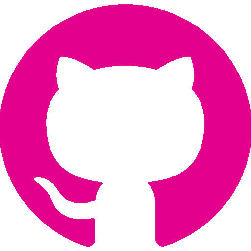

<!--
**NicoletaSerban/NicoletaSerban** is a ✨ _special_ ✨ repository because its `README.md` (this file) appears on your GitHub profile.

Here are some ideas to get you started:

- 🔭 I’m currently working on ...
- 🌱 I’m currently learning ...
- 👯 I’m looking to collaborate on ...
- 🤔 I’m looking for help with ...
- 💬 Ask me about ...
- 📫 How to reach me: ...
- 😄 Pronouns: ...
- ⚡ Fun fact: ...
-->

  
  

## 
I am Nicoleta. An adaptable, detail-oriented software engineer with a passion for developing creative and efficient solutions to complex problems.
  
  

   

<!-- ## My Skill Set  
<table><tr><td valign="top" width="33%">

### Frontend  

  
  
  
  
  
  
  

</td><td valign="top" width="33%">

### Backend  

  
  
  
  
  
  

</td><td valign="top" width="33%">

</td></tr></table>  

    -->

<h1>Connect with me</h1> 

<!--  -->

<!--  -->

<h1 align="center">Technologies</h1>

    
    
<!--      -->
<!--      -->
    
    
<!--      -->
<!--      -->
    
<!--      -->
<!--      -->
<!--      -->
<!--      -->
    
    
<!--      -->
<!--      -->
    

<!-- 

 -->

<!-- ## Connect with me  

  
  

    -->

## Github Stats  

  

   

## Recent Blog Posts  
  

   

  

   

  

   

 

